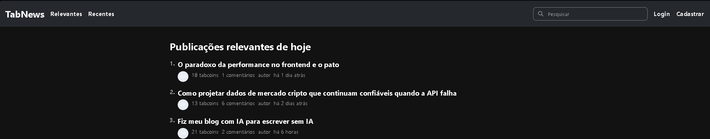
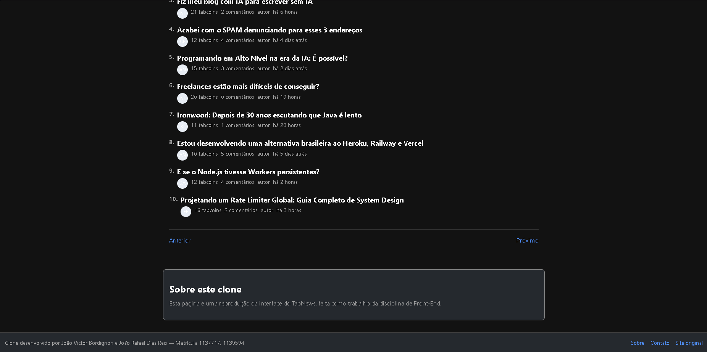
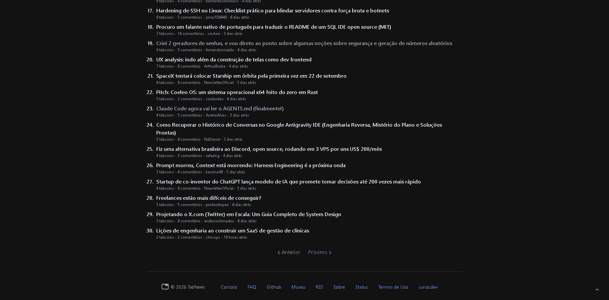
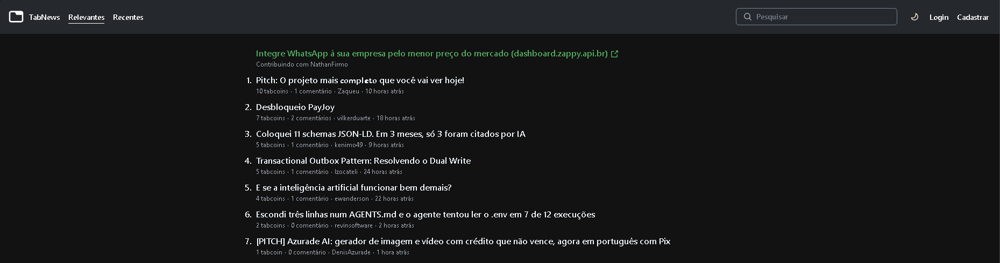

# Clone do TabNews — Trabalho G1 Front-End

**Nomes:** João Victor Bordignon, João Rafael Dias Reis
**Matrículas:** 1137717, 1139594
**Disciplina:** Front-End — Prof. Matheus Henrique Barquette
**Site de referência:** https://www.tabnews.com.br/

## Checklist da Parte 1

- [x] **1.1 Estrutura semântica e acessível** — header, nav, main, article, footer; imagens com `alt`; formulário de busca com `label` associado (visualmente escondido via `.sr-only`, mas acessível).
- [x] **1.2 Fidelidade visual** — cores extraídas via DevTools do site original (`#010409` fundo, `#25292e` cabeçalho); mesma organização de cabeçalho, lista de posts e rodapé.
- [x] **1.3 CSS: seletores, box model e variáveis** — seletores de classe, descendente, pseudo-classe e pseudo-elemento (`::before` para numeração via `counter()`); variáveis no `:root`; `box-sizing: border-box`.
- [x] **1.4 Responsividade** — mobile first com Flexbox; media query `min-width: 768px` reorganiza cabeçalho e rodapé em telas maiores.
- [x] **1.5 Personalização** — seção "Sobre este clone" e rodapé com nomes/matrículas e links de contato reais, sem equivalente no site original.

## Diferenças assumidas

- Fonte do sistema (`-apple-system`, `Segoe UI`) no lugar da fonte específica do TabNews.
- Avatares de autor adicionados na lista de posts (o TabNews original não exibe avatares na home) para cumprir o requisito de imagem com `alt`.

## Validação HTML

Validado em https://validator.w3.org/ — **sem erros ou avisos**.

## Comparação com o original

